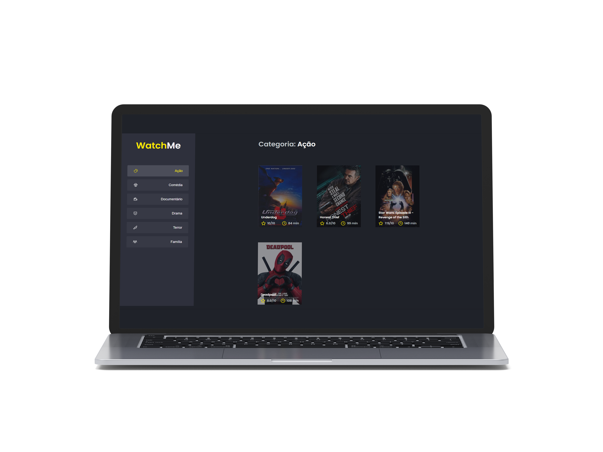

<h1 align="center">
  
</h1>

  <a href="#-tecnologias">Tecnologias</a>&nbsp;&nbsp;&nbsp;|&nbsp;&nbsp;&nbsp;
  <a href="#-projeto">Projeto</a>&nbsp;&nbsp;&nbsp;|&nbsp;&nbsp;&nbsp;
  <a href="#-como-executar">Como executar</a>&nbsp;&nbsp;&nbsp;|&nbsp;&nbsp;&nbsp;

  

## 🚀 Tecnologias
- [ReactJS](https://reactjs.org)
- [TypeScript](https://www.typescriptlang.org)

## 💻 Projeto
o Watchme é um desafio que faz parte da trilha de ReactJS do Ignite da [Rocketseat](https://www.rocketseat.com.br) no qual o intuito do desafio era realizar a componentização, ou seja, dividir a aplicação em componentes React como parte do aprendizado da tecnologia e para fixar os conceitos aprendidos.

## Como executar
- clone o repositório
- utilize o comando `yarn` no terminal para instalar as dependências
- inicie o servidor com o comando `yarn server`
- rotas disponíveis em http://localhost:3333/genres e http://localhost:3333/movies
- inicie a aplicação com `yarn dev`

---
Feito com 💜 como parte da trilha de React da Rocket.
